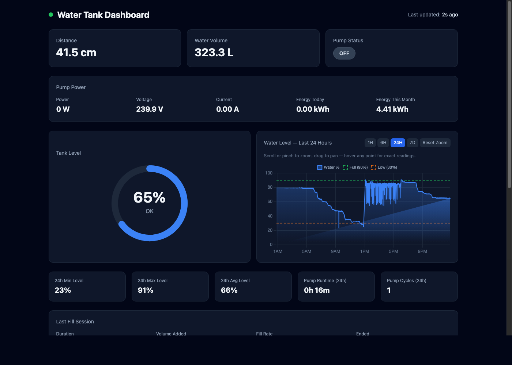
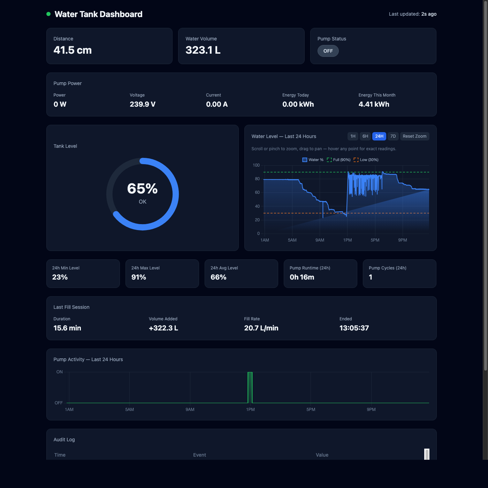
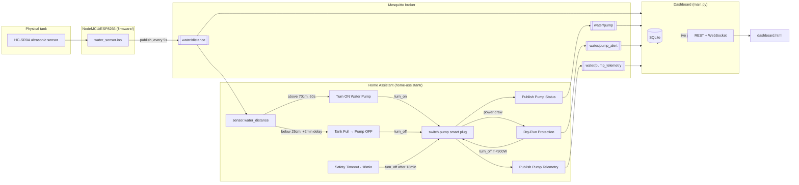

# AquaSentry

A self-hosted water tank monitoring dashboard with automated pump control, built for a Raspberry Pi + Home Assistant + Mosquitto setup.



<details>
<summary>Full dashboard (charts, fill session, pump activity, audit log)</summary>



</details>

## What it does

- Tracks tank water level in real time via an ultrasonic distance sensor (NodeMCU/ESP8266 over MQTT)
- Live dashboard: current level, volume, pump status, historical charts with zoom/pan, audit log
- Tracks pump power telemetry (wattage, voltage, current, energy) via a smart plug
- Home Assistant automations for safe pump control:
  - Turns the pump on when the tank runs low (debounced against sensor noise)
  - Turns the pump off once the tank is full (fixed-delay shutoff, immune to noisy near-full readings)
  - Dry-run protection — cuts power if wattage drops below a safe threshold (indicating the pump is running without water)
  - Blanket safety timeout as a last-resort backstop
- Fill-rate analytics from historical data (L/min, time-to-fill estimates)

## End-to-end flow

Three independent systems talk only through MQTT — the firmware and Home Assistant never call each other directly, and the dashboard only *observes* the same topics everyone else uses.



**Walkthrough:**

1. The ultrasonic sensor measures distance to the water surface; the NodeMCU publishes it to `water/distance` every 5 seconds.
2. Home Assistant exposes that as `sensor.water_distance`, which two automations watch:
   - **Turn ON Water Pump** — fires once the reading stays above 70cm (tank low) for 60 continuous seconds, then turns the pump on.
   - **Tank Full → Pump OFF** — fires on the *first* reading below 25cm, waits a fixed 2 minutes (ignoring sensor noise during that window), then turns the pump off unconditionally.
3. Two independent backstops watch the pump switch itself, not the tank sensor:
   - **Safety Timeout** cuts power after 18 minutes of continuous runtime no matter what.
   - **Dry-Run Protection** watches the smart plug's own wattage — if it drops below a safe threshold (motor spinning without water load), it cuts power immediately and publishes to `water/pump_alert`.
4. Every pump state change and telemetry sample gets mirrored back to MQTT (`water/pump`, `water/pump_telemetry`) purely for observability — nothing subscribes to these to make control decisions.
5. The dashboard app subscribes to all four topics, persists readings/events to SQLite, and pushes live updates to the browser over a WebSocket. It never talks to Home Assistant directly — it only reads the same MQTT stream everything else does.

## Stack

- **Backend**: FastAPI + `aiosqlite` + `paho-mqtt`, single `main.py`
- **Frontend**: single `dashboard.html` (Tailwind + Chart.js via CDN, no build step)
- **Deployment**: Docker Compose, reaches the host's MQTT broker via `host.docker.internal`

## Running it

```bash
docker compose up -d --build
```

Configurable via environment variables (see `docker-compose.yml`):

| Variable | Default | Purpose |
|---|---|---|
| `MQTT_HOST` | `localhost` | MQTT broker address |
| `MQTT_PORT` | `1883` | MQTT broker port |
| `APP_PORT` | `8080` | Port the app listens on inside the container |
| `TANK_DB_PATH` | `./tank.db` | SQLite database path |

## MQTT topics

| Topic | Direction | Payload |
|---|---|---|
| `water/distance` | in | float, cm from sensor to water surface |
| `water/pump` | in | `on` / `off`, retained |
| `water/pump_alert` | in | e.g. `dry_run` |
| `water/pump_telemetry` | in | JSON: power/voltage/current/energy |

Tank calibration (empty/full distance, capacity) is set via constants at the top of `main.py`.

## Home Assistant automations

Pump control logic (turn on/off, dry-run protection, safety timeout) lives in Home Assistant, not in this app — see [`home-assistant/`](home-assistant/) for the automations and setup instructions. Entity IDs there are generalized placeholders (`switch.pump`, `sensor.pump_power`, etc.) — substitute your own smart plug/sensor entities.

## Firmware

The NodeMCU/ESP8266 sketch that publishes tank distance readings lives in [`firmware/`](firmware/), along with wiring notes and known sensor limitations.
